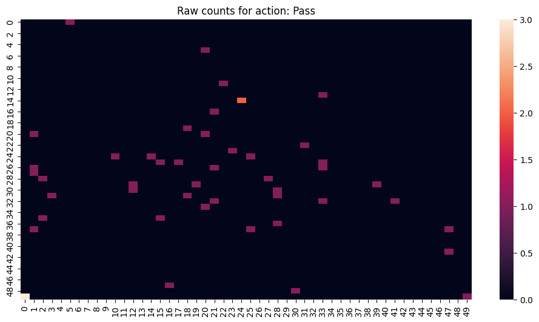
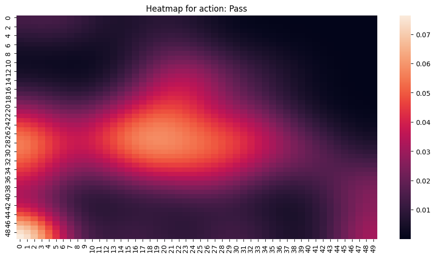

# playervectors
Implementation of [Player Vectors: Characterizing Soccer Players Playing Style from Match Event Streams](https://ecmlpkdd2019.org/downloads/paper/701.pdf)


### Create a ConditionData
```python
# creat an instance
#_conditions take a list of functions 
    conditionData = ConditionData(dataset_name="Example",_conditions=[lambda x: x["subEventName"] == "Simple pass"],
                        dataset_link="data\\example_data.csv", 
                        playerheatmap=player.PlayerHeatMap(shape=(50,50)))
# creats an DataFrame
    conditionData.create_conditionData()
# creats an File with the content of the DataFrame
    conditionData.creat_file("data\\Example")
    plt.figure(figsize=(12, 6))
#calls supmethode from the playerheatmap
    conditionData.fit("pos_orig_x","pos_orig_y")
    conditionData.heatmap()
    plt.show()

```

#### Load Action Data

```python
import pandas as pd
df = pd.read_csv('data/Passes.csv')
x, y = list(df['x']), list(df['y'])
```
#### PlayerHeatMap: Visualize raw counts of action

```python
import matplotlib.pyplot as plt
from playervectors import PlayerHeatMap

# Create Action Component
action_pass = PlayerHeatMap(action_name='Pass')

# Fit action
action_pass.fit(x, y)

# Visualize Playing style for desired action as raw counts
plt.figure(figsize=(12, 6))
action_pass.raw_counts()
plt.show()
```


#### PlayerHeatMap: Visualize heatmap of action

```python
import matplotlib.pyplot as plt
from playervectors import PlayerHeatMap

# Create Action Component
action_pass = PlayerHeatMap(action_name='Pass')

# Fit action
action_pass.fit(x, y)

# Visualize Playing style for desired action as heatmap
plt.figure(figsize=(12, 6))
action_pass.heatmap()
plt.show()
```



## Use Repository with Data

#### 1. Download this [Dataset](https://www.kaggle.com/datasets/aleespinosa/soccer-match-event-dataset) on Kaggle

#### 2. Create a folder named event_streams in this Repository

```bash
mkdir event_streams
```

#### 3. Copy all .csv files from the Dataset in the folder event_streams


## About the Datasets

### Dataset 1
All the credit is to Luca Pappalardo and Emmanuele Massucco.

[https://www.kaggle.com/datasets/aleespinosa/soccer-match-event-dataset](https://www.kaggle.com/datasets/aleespinosa/soccer-match-event-dataset)

### Dataset 2
This dataset contains European football team stats.
Only teams of Premier League, Ligue 1, Bundesliga, Serie A and La Liga are listed.

[https://www.kaggle.com/datasets/vivovinco/football-analytics](https://www.kaggle.com/datasets/vivovinco/football-analytics)


## Citations

```bibtex
@article{ecmlpkdd2019,
  title     = {Player Vectors: Characterizing Soccer Players’
Playing Style from Match Event Streams},
  author    = {Tom Decroos, Jesse Davis},
  journal   = {ecmlpkdd2019},
  year      = {2019},
}
```

#### Paper of Author: [paper](https://ecmlpkdd2019.org/downloads/paper/701.pdf)
#### PowerPoint of Author: [powerpoint](https://tomdecroos.github.io/reports/playing-style-wide-v2.pdf)
