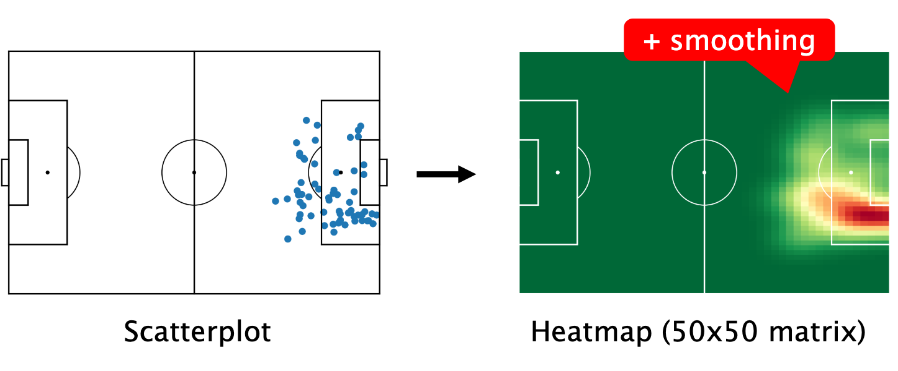

# playervectors
Implementation of [Player Vectors: Characterizing Soccer Players Playing Style from Match Event Streams](https://ecmlpkdd2019.org/downloads/paper/701.pdf) in python.

## Usage

```python
from playervectors import PlayerVectors


pvs = PlayerVectors(shape=(50, 50),
                    actions=['shot', 'cross', 'dribble', 'pass'],
                    components=[4, 4, 5, 5])

pvs.fit(coordinates=coordinates,
        minutes_played=minutes_played,
        player_names=playersID_to_name,
        verbose=True)
```

## Building Player Vectors

### 1. Selecting Relevant Action Types
Let $k_t$ be the number of principal components chosen to compress heatmaps of action type $t$.

According to the paper, $k_t$ with $t \in$ {shot, cross, dribble, pass} with corresponding components {4, 4, 5, 5} is the minimal number of components needed to explain 70% of the variance in the heatmaps of action type $t$.


This parameter setting
was empirically found to work well because of the high variability of players
positions in their actions (see Challenge 1 in Section 2 in the paper).

Ignoring 30% of the variance allows to summarize a player’s playstyle only by his dominant regions
on the field rather than model every position on the field he ever occupied.


### 2. Constructing Heatmaps

#### 2.1 Counting


<p style="font-size: 12px; text-align: center;">
    <em>Source: Tom Decroos and Jesse Davis, September 19th, 2019 ECMLPKDD</em>
</p>

#### 2.2 Normalizing


<p style="font-size: 12px; text-align: center;">
    <em>Source: Tom Decroos and Jesse Davis, September 19th, 2019 ECMLPKDD</em>
</p>

#### 3.3 Smoothing


<p style="font-size: 12px; text-align: center;">
    <em>Source: Tom Decroos and Jesse Davis, September 19th, 2019 ECMLPKDD</em>
</p>


### 3. Compressing Heatmaps to Vectors

#### 3.1 Reshaping


<p style="font-size: 12px; text-align: center;">
    <em>Source: Tom Decroos and Jesse Davis, September 19th, 2019 ECMLPKDD</em>
</p>


#### 3.2 Construct the matrix M


<p style="font-size: 12px; text-align: center;">
    <em>Source: Tom Decroos and Jesse Davis, September 19th, 2019 ECMLPKDD</em>
</p>


#### 3.3 Compress matrix M by applying non-negative matrix factorization (NMF)


<p style="font-size: 12px; text-align: center;">
    <em>Source: Tom Decroos and Jesse Davis, September 19th, 2019 ECMLPKDD</em>
</p>


### 4. Assembling Player Vectors
The player vector v of a player p is the concatenation of his compressed vectors
for the relevant action types.

## Detailed Algorithm


## Use Repository with Data

#### 1. Download this [Dataset](https://www.kaggle.com/datasets/aleespinosa/soccer-match-event-dataset) on Kaggle

#### 2. Create a folder named event_streams in this Repository

```bash
mkdir event_streams
```

#### 3. Copy all .csv files from the Dataset in the folder event_streams


## About the Datasets

### Dataset 1
All the credit is to Luca Pappalardo and Emmanuele Massucco.

[https://www.kaggle.com/datasets/aleespinosa/soccer-match-event-dataset](https://www.kaggle.com/datasets/aleespinosa/soccer-match-event-dataset)

### Dataset 2
This dataset contains European football team stats.
Only teams of Premier League, Ligue 1, Bundesliga, Serie A and La Liga are listed.

[https://www.kaggle.com/datasets/vivovinco/football-analytics](https://www.kaggle.com/datasets/vivovinco/football-analytics)

## Citations

```bibtex
@article{ecmlpkdd2019,
  title     = {Player Vectors: Characterizing Soccer Players’
Playing Style from Match Event Streams},
  author    = {Tom Decroos, Jesse Davis},
  journal   = {ecmlpkdd2019},
  year      = {2019},
}
```